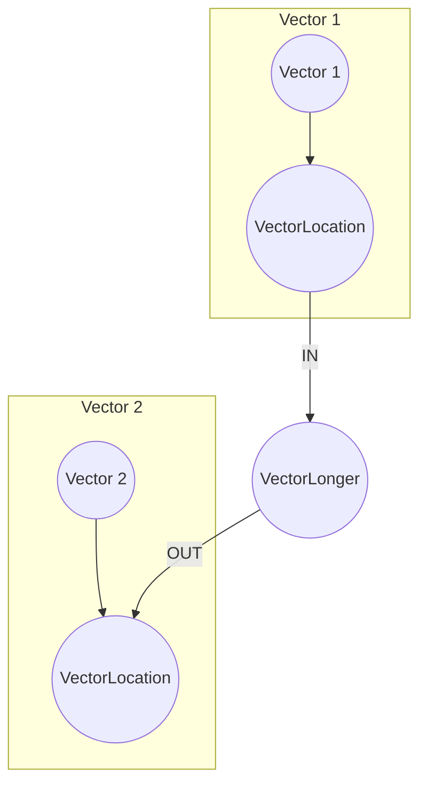
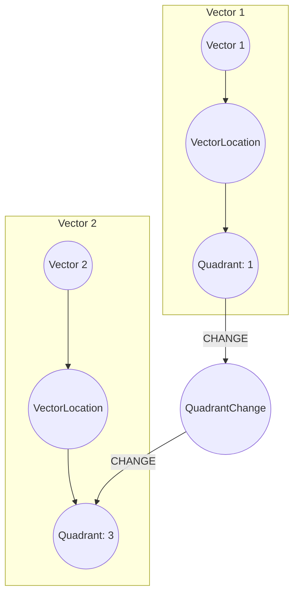

# Features

## Prefixes for features

There are list of prefixes in the system for different structures:

- **AnglePoint** (intercestion point of 2 lines/vectors)
- **Vector** (line that has been truncated to the angle points)
- **Line** (result of line detector activation)
- **CriticalPoint** (point of the exposition that is critical for the recognized structure)

## Set of features

### Primary features

| Feature name    | Category    | Description                                                                                                                                                              |
| --------------- | ----------- | ------------------------------------------------------------------------------------------------------------------------------------------------------------------------ |
| Absolute        | Length      | Absolute value of the length of the structure in pixels                                                                                                                  |
| Magnitude       | Length      | The size of the vector                                                                                                                                                   |
| Angle           | Orientation | The direction of the structure is represented as an angle relative to a reference axis or plane                                                                          |
| Coordinates     | Location    | Coordinates of the structure. Might be (x, y) in case of a point and pair of coordinates [(x1, y1), (x2, y2)] in case of line/vector                                     |
| HalfPlane       | Location    | The half-plane in which the vector lies, determined by its orientation and position.                                                                                     |
| **Vector**Value | Location    | The numerical representation of the vector in terms of its components, particularly when the coordinate system is translated to the vector's starting point              |
| Quadrant        | Location    | The specific quadrant of the coordinate system in which the vector/line is located, particularly when the coordinate system is translated to the vector's starting point |

### Secondary features

| Feature name             | Category | Description                                                                                          |
| ------------------------ | -------- | ---------------------------------------------------------------------------------------------------- |
| **Vector**Direction      | Location | Determining whether a vector moves clockwise or counterclockwise                                     |
| **Vector**Comparison     | Location | Compares the magnitudes of vectors that intersect to assess their relative influence or significance |
| **Vector**QuadrantChange | Location | Determining whether a vector changed a direction of development to the new quadrant                  |

# Features calculation

## Primary features

### VectorAngle

The angle of the vector is calculated as the angle between the vector and the reference axis. The reference axis is the x-axis of the coordinate system. The angle is calculated using the formula:

1. Converting endpoints into vectors

$$
\vec{v}_1 = \begin{bmatrix} x_2 - x_1 \\ y_2 - y_1 \end{bmatrix}, \quad \vec{v}_2 = \begin{bmatrix} x_4 - x_3 \\ y_4 - y_3 \end{bmatrix}
$$

2. Dot product of vectors

$$
\vec{v}_1 \cdot \vec{v}_2 = (x_2 - x_1)(x_4 - x_3) + (y_2 - y_1)(y_4 - y_3)
$$

3. Magnitude of vectors

$$
||\vec{v}_1|| = \sqrt{(x_2 - x_1)^2 + (y_2 - y_1)^2}, \quad ||\vec{v}_2|| = \sqrt{(x_4 - x_3)^2 + (y_4 - y_3)^2}
$$

4. Cosine of the angle

$$
\cos(\theta) = \frac{\vec{v}_1 \cdot \vec{v}_2}{||\vec{v}_1|| \cdot ||\vec{v}_2||}
$$

Ensure the cosine value is within the valid range:

$$
\cos(\theta) = \max(\min(\cos(\theta), 1), -1)
$$

5. Angle in radians

$$
\theta = \arccos(\cos(\theta)) \times \left(\frac{180}{\pi}\right)
$$

### VectorMagnitude

The magnitude of the vector is calculated as the length of the vector. The length is calculated using the formula:

$$
\sqrt{(x_2 - x_1)^2 + (y_2 - y_1)^2}
$$

### VectorValue

The numerical representation of the vector in terms of its components, particularly when the coordinate system is translated to the vector's starting point. The vector value is calculated using the formula:

$$
\begin{bmatrix} x_2 - x_1 \\ y_2 - y_1 \end{bmatrix}
$$

### VectorQuadrant

The specific quadrant of the coordinate system in which the vector/line is located, particularly when the coordinate system is translated to the vector's starting point. The quadrant is calculated using the formula:

$$
\begin{cases}
\text{I} & \text{if } dx > 0 \text{ and } dy > 0 \\
\text{II} & \text{if } dx < 0 \text{ and } dy > 0 \\
\text{III} & \text{if } dx < 0 \text{ and } dy < 0 \\
\text{IV} & \text{if } dx > 0 \text{ and } dy < 0 \\
\end{cases}
$$

dx and dy are the differences between the x and y coordinates of the vector's endpoints:

$$
\begin{cases}
dx = x_2 - x_1 \\
dy = y_2 - y_1 \\
\end{cases}
$$

### VectorHalfPlane

The half-plane in which the vector lies, determined by its orientation and position. The half-plane is calculated using the formula:

Horizontal half-plane:

$$
\begin{cases}
\text{UPPER} & \text{if } dy > 0 \\
\text{LOWER} & \text{if } dy \leq 0 \\
\end{cases}
$$

Vertical half-plane:

$$
\begin{cases}
\text{RIGHT} & \text{if } dx > 0 \\
\text{LEFT} & \text{if } dx \leq 0 \\
\end{cases}
$$

## Secondary features

### VectorDirection

Given two vectors $`\vec{v}_1 = [x_{v1}, y_{v1}]`$ and $`\vec{v}_2 = [x_{v2}, y_{v2}]`$ the cross product in a two-dimensional space can be represented using the determinant of a matrix formed by these vectors:

```math
\vec{v}_1 \times \vec{v}_2 = \begin{vmatrix}
\hat{i} & \hat{j} \\
x_{v1} & y_{v1} \\
x_{v2} & y_{v2} \\
\end{vmatrix}
```

This determinant simplifies to:

```math
\vec{v}_1 \times \vec{v}_2 = (x_{v1} \cdot y_{v2} - y_{v1} \cdot x_{v2})
```

In the context of two-dimensional space, the directionality given by the cross product can be interpreted as:

$$
\begin{cases}
\text{counterclockwise} & \text{if } \vec{v}_1 \times \vec{v}_2 > 0 \\
\text{clockwise} & \text{if } \vec{v}_1 \times \vec{v}_2 < 0 \\
\text{collinear} & \text{if } \vec{v}_1 \times \vec{v}_2 = 0 \\
\end{cases}
$$

### VectorComparison

The comparison of vectors is used to assess their relative influence or significance. The comparison is calculated using the formula:

$$
\begin{cases}
\text{v1} & \text{if } ||\vec{v}_1|| > ||\vec{v}_2|| \\
\text{v2} & \text{if } ||\vec{v}_1|| < ||\vec{v}_2|| \\
\text{equal} & \text{if } ||\vec{v}_1|| = ||\vec{v}_2|| \\
\end{cases}
$$

Based on the comparison, we create a new feature that represents the relative influence of the vectors.

For example, if vector 1 is greater than vector 2, the new feature will look like this:



### VectorQuadrantChange

The change of the vector's direction to the new quadrant is determined by the change of the vector's quadrant. The change is calculated using the formula:

$$
\begin{cases}
\text{change} & \text{if } \text{quadrant}(\vec{v}_1) \neq \text{quadrant}(\vec{v}_2) \\
\text{no change} & \text{if } \text{quadrant}(\vec{v}_1) = \text{quadrant}(\vec{v}_2) \\
\end{cases}
$$

Based on the change, we create a new feature that represents the change of the vector's direction to the new quadrant.

For example, if the vector's direction has changed, the new feature will look like this:


